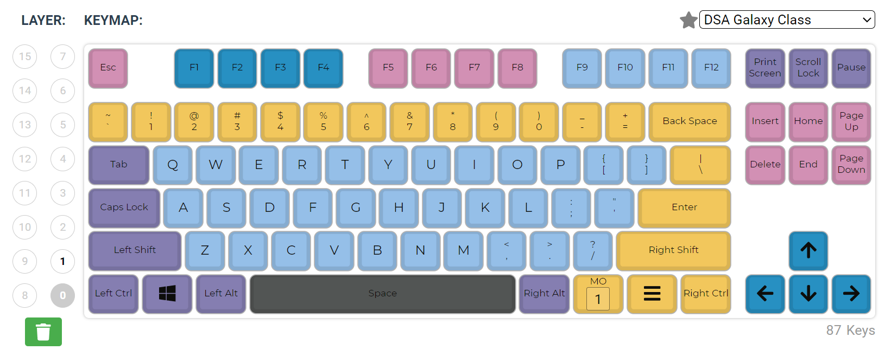
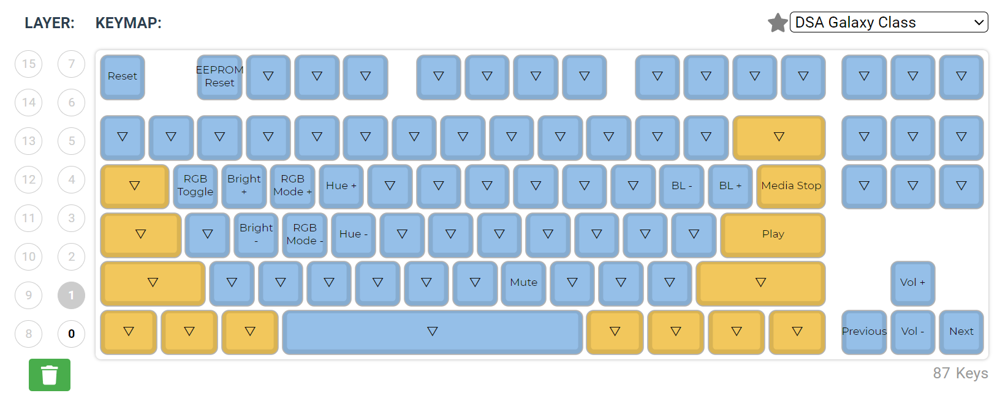

# XD87 Custom Keymap
QMK keymap for XD87 PCB (ANSI layout).

## QMK Layers

### Layer 0 (base)


### Layer 1 (RGB underglow and multimedia)


## QMK configuration
Compile/flash command:
```bash
qmk <compile/flash> --keyboard xiudi/xd87 --keymap mykeyboard
```

You can also compile the .json file via https://config.qmk.fm/, and then flash the .hex using [QMK Toolbox](https://github.com/qmk/qmk_toolbox).
However, this compiltation does not enables the rules.mk 